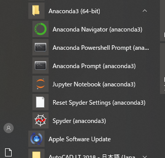

# Hello Python - Python のはじめかた  

このドキュメントは Sansaku Python Community (SPC) のこれから Python をはじめるメンバー向けに作成したものです。  

## Python とは  

Python は、比較的学習しやすく様々な用途に利用可能なオープンソースライセンスで提供されているプログラミング言語です。  

[Welcome to Python.org (公式)](https://www.python.org/)  
[Top - python.jp (日本の Python コミュニティ)](https://www.python.jp/)  
[Python - Wikipedia](https://ja.wikipedia.org/wiki/Python)  

> 文法を極力単純化してコードの可読性を高め、読みやすく、また書きやすくしてプログラマの作業性とコードの信頼性を高めることを重視してデザインされた、汎用の高水準言語である。  
> 核となる本体部分は必要最小限に抑えられている。一方で標準ライブラリやサードパーティ製のライブラリ、関数など、さまざまな領域に特化した豊富で大規模なツール群が用意され、インターネット上から無料で入手でき、自らの使用目的に応じて機能を拡張していくことができる。(Wikipedia より引用)  

## WEB を利用して手っ取り早く Python を使う  

インターネットを利用できる PC 環境 (スマホは厳しい) であれば、WEB 上の様々な無料サービスを利用してすぐに Python に触れることができます。  

### Google Colaboratory を利用する  

[Colaboratory へようこそ - Colaboratory](https://colab.research.google.com)

Colaboratory (以下 Colab) は Google が提供する、完全にクラウドで実行される Jupyter Notebook 環境であり、無料で利用することができる。  

特徴  

- インターネット接続に加えて、Google アカウントがあればいつでも始めることができる。  
- 自分の Google ドライブに Notebook やデータを保存できる。  
- 自分の Google ドライブの Notebook やデータを利用できる。  
- GPU や専用のプロセッサも無料で利用できる。  
- いくつかの練習用データセットがデフォルトで利用可能。  
- その他、本来の Jupyter Notebook にはない機能が多数存在する。  

注意点  

- **Google アカウントが必要。**  
- Jupyter Notebook とは若干操作方法が異なる。  
- 連続利用可能な時間に制限があり、Notebook を開いて最大 12 時間まで。ただし 90 分間何らかの操作が無ければ切断されてしまう。  
※ Try Jupyter よりも制限時間は長く、作成したファイルは Google ドライブに保存されるため消失してしまうことはない。  

### Try Jupyter を利用する  

[Project Jupyter | Try Jupyter](https://jupyter.org/try)

Try Jupyter は Project Jupyter が提供しているサービスである。  
このサービスは下記のような特徴を持っており、Python コードを簡単かつ迅速に試したり、練習したりすることに向いている。ただし、作成したファイルを保存したのち、後日作業を再開するためには、ファイルのダウンロード＆アップロードが必要である点に注意しなければならない。  

特徴  

- インターネット接続さえ可能ならば、Python や Jupyter Notebook をインストールしたりする手間なしに無料で簡単に始めることができる。  
- アカウント登録などは一切不要。  
- ローカル PC にインストールした Jupyter Notebook と画面や操作方法が同じ。  

注意点  

- 同時利用者が多いとサービスが利用できない場合がある。  
- 作成したファイルの保存が面倒。(ダウンロードしてローカルPCなどに保存)  
- しばらく (数十分？) 放置しているとサーバが終了してしまい、作成したファイルはすべて失われる。そのため保存したいデータはまめにダウンロードしなければならない。  
- 以前の作業を再開するにはダウンロードしたファイルをアップロードしなければならない。  

### プログラミング教育サービスを利用する  

[Progate | プログラミングの入門なら基礎から学べるProgate[プロゲート]](https://prog-8.com/)  
[SoloLearn: Learn to Code for Free!](https://www.sololearn.com/)  

## 自分のパソコンで Python を使う  

### Anaconda Distribution を利用する  

Anaconda を使えば Python に加えて、データ分析に利用される様々なパッケージを同時にインストールすることができる。例として、  

- Beautiful Soup → HTML の解析  
- Jupyter Notebook/JupyterLab → Python による対話的なデータ分析実行環境 
- NumPy → 高速な配列、行列操作  
- Pandas → 表形式データの操作  
- Matplotlib/seaborn → 図によるデータの可視化  
- scikit-learn → 統計的なデータ分析  
- Sphinx → ドキュメント作成  
- pywin32 → Windows (Win32 API) の操作
- xlwings/openpyexl → Excel の操作  

などがすぐに利用できるようになる。  
また、下記のパッケージなども追加でダウンロードすることができる。    

- TensorFlow → Deep Learning フレームワーク (Google 製)  
- PyTorch → Deep Learning フレームワーク (Facebook 製)  
- Selenium → WEB ブラウザの操作  

さらに、`conda` コマンドで仮想環境やパッケージの管理もできるようになる。  
Python を対象とした書籍でも、多くの場合 Anaconda を利用して環境構築を行っているため、Python 初学者に対しては Anaconda を利用することをおすすめする。  

Anaconda のインストーラのダウンロードはここから  
[Anaconda Python/R Distribution - Free Download](https://www.anaconda.com/distribution/)  

Miniconda (必要最小限のパッケージのみ) のダウンロードはここから  
[Miniconda — Conda documentation](https://docs.conda.io/en/latest/miniconda.html)

Anaconda のインストール先についてはデフォルトのままでもよいが、今後インストールするパッケージによっては、Windows の最長パス制限を超過することによって不具合が生じる可能性があるため、あまり深すぎない場所にインストールしたほうがいいかも。(`C:\Users\[USERPROFILE]\Anaconda3` などを推奨)  

インストールが完了したら、スタートメニューから、  
  
上記のように追加されていることが確認できる。  

### 公式から Python をダウンロードする  

Python Software Foundation (PSF) から Python のダウンロードはここから  
[Download Python | Python.org](https://www.python.org/downloads/)

この方法の場合、`pip` コマンドで PyPI (The Python Package Index) からパッケージをダウンロードし、venv や pipenv などの仮想環境管理ツールと組み合わせて利用することになる。  

## Python の基本文法やその他有用な WEB サイトについて  

### WEB サイト  

- 基本文法  
  - [Python入門 - ＠IT](https://www.atmarkit.co.jp/ait/series/12963/)  
  - [Pythonチートシート - ＠IT](https://www.atmarkit.co.jp/ait/series/17323/)  
  - [【連載】ゼロからはじめるPython | マイナビニュース](https://news.mynavi.jp/series/zeropython)  

- データサイエンス 機械学習  
  - [機械学習＆ディープラーニング入門（Python編） - ＠IT](https://www.atmarkit.co.jp/ait/series/15506/)
  - [ディープラーニング入門：Chainer チュートリアル]( https://tutorials.chainer.org/ja/)  
  - [メディカルAI専門コース オンライン講義資料 — メディカルAI専門コース オンライン講義資料 documentation](https://japan-medical-ai.github.io/medical-ai-course-materials/)  
  - [Learn | Kaggle](https://www.kaggle.com/learn/overview)  
  - [piqcy | Revue](https://www.getrevue.co/profile/icoxfog417?utm_campaign=Issue&utm_content=profileimage&utm_medium=email&utm_source=piqcy)  

- 腕試し  
  - [Project Euler](https://projecteuler.net)  
  - [AtCoder：競技プログラミングコンテストを開催する国内最大のサイト](https://atcoder.jp/?lang=ja)  
  - [TOP | SIGNATE - Data Science Competition](https://signate.jp/)  
  - [Kaggle: Your Home for Data Science](https://www.kaggle.com/)  

### 書籍  

技術開発グループで購入した書籍が多数あります。GroupSession の 施設予約でも確認/貸し出し予約ができますのでご覧ください。  
