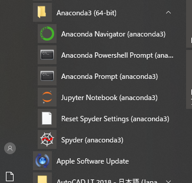

# Pythonのはじめかた  

この記事ではPythonを手っ取り早く使ってみる方法や、ローカルPCへインストールする方法を紹介しています。  

## Pythonとは  

Pythonは、比較的学習しやすくさまざまな用途に利用可能なオープンソースライセンスで提供されているプログラミング言語です。  

> Python（パイソン）はインタープリタ型の高水準汎用プログラミング言語である。  
> （中略）  
> Pythonには、読みやすく、それでいて効率もよいコードをなるべく簡単に書けるようにするという思想が浸透しており、Pythonコミュニティでも単純で簡潔なコードをよしとする傾向が強い。Pythonの本体は、ユーザがいつも必要とする最小限の機能のみを提供する。基本機能以外の専門機能や拡張プログラムはインターネット上にライブラリとして提供されており、別途ダウンロードして保存し、必要なツールはこのツールキットからその都度呼び出して使用する。（Wikipediaより引用）  

[Welcome to Python.org（公式)](https://www.python.org/)  
[Top - python.jp（日本の Python コミュニティ)](https://www.python.jp/)  
[Python - Wikipedia](https://ja.wikipedia.org/wiki/Python)  

---

## WEBを利用して手っ取り早くPythonを使う  

インターネットを利用できるPC環境（スマホは厳しい）であれば、WEB上のさまざまな無料サービスを利用して**すぐに**Pythonに触れることができます。  

### Google Colaboratoryを利用する  

[Colaboratory へようこそ - Colaboratory](https://colab.research.google.com)  

> Colaboratory（以下Colab）は、Googleが提供する、完全にクラウドで実行されるJupyter Notebook環境であり、無料で利用することができる。  

特徴  

- インターネット接続に加えて、Googleアカウントがあればいつでも始めることができる。  
- 自分のGoogleドライブにNotebook（.ipynb）やデータを保存できる。  
- 自分のGoogleドライブのNotebook（.ipynb）やデータを利用できる。  
- GPUや専用のプロセッサも無料で利用できる。  
- いくつかの練習用データセットがデフォルトで利用可能。  
- その他、本来のJupyter Notebookにはない機能が多数存在する。  

注意点  

- **Googleアカウントが必要。**  
- Jupyter Notebookとは若干操作方法が異なる。  
- 連続利用可能な時間に制限があり、Notebookを開いて最大12時間まで。ただし90分間何らかの操作が無ければ切断されてしまう。  
※ Try Jupyterよりも制限時間は長く、作成したファイルはGoogleドライブに保存されるため消失してしまうことはない。  

### Try Jupyterを利用する  

[Project Jupyter | Try Jupyter](https://jupyter.org/try)  

> Try JupyterはProject Jupyterが提供しているサービスである。  
このサービスは下記のような特徴を持っており、Pythonコードを簡単かつ迅速に試したり、練習したりすることに向いている。ただし、作成したファイルを保存したのち、後日作業を再開するためには、ファイルのダウンロード＆アップロードが必要である点に注意しなければならない。  

特徴  

- インターネット接続さえ可能ならば、PythonやJupyter Notebookをインストールしたりする手間なしに無料で簡単に始めることができる。  
- アカウント登録などは一切不要。  
- ローカルPCにインストールしたJupyter Notebookと画面や操作方法が同じ。  

注意点  

- 同時利用者が多いとサービスを利用できない場合がある。  
- 作成したファイルの保存が面倒。（.ipynbとしてダウンロードしてローカルPCなどに保存しなければならない）
- しばらく（数十分？）放置しているとサーバが終了してしまい、作成したファイルはすべて失われる。そのため保存したいデータはまめにダウンロードしなければならない。  
- 以前の作業を再開するにはダウンロードしたファイル（.ipynb）をアップロードしなければならない。  

### プログラミング教育サービスを利用する  

[Progate | プログラミングの入門なら基礎から学べるProgate[プロゲート]](https://prog-8.com/)  
[SoloLearn: Learn to Code for Free!](https://www.sololearn.com/)  

---

## 自分のパソコンでPythonを使う  

Pythonのによる処理の実行方法は、大別して3つあります。  

1. Pythonインタプリタを起動して対話的に処理を行う。  
1. Pythonインタプリタに処理を記述したPythonスクリプトを読み込ませる。  
1. Jupyter（前述のGoogle ColaboratoryやTry Jupyterのようなツール。要インストール）を起動して対話的に処理を行う。  

Pythonを手元のパソコンにインストールすることで、上記のような方法で処理を行うことができます。  

### インストール方法1 Anaconda Distributionを利用する  

> Anacondaは、 科学計算（データサイエンス、機械学習アプリケーション、大規模データ処理、予測分析など）のためのPythonおよびR言語の無料のオープンソースディストリビューションであり、パッケージ管理とデプロイメントを簡略化することを狙ったものである。（Wikipediaより引用）

Anacondaを使えばPythonに加えて、データ分析に利用されるさまざまなパッケージを同時にインストールできます。例として、  

- Beautiful Soup → HTMLの解析  
- Jupyter Notebook/JupyterLab → Pythonによる対話的なデータ分析実行環境  
- NumPy → 高速な配列、行列操作  
- Pandas → 表形式データの操作  
- Matplotlib/seaborn → 図によるデータの可視化  
- scikit-learn → 統計的なデータ分析  
- Sphinx → ドキュメント作成  
- pywin32 → Windows（Win32 API）の操作  
- xlwings/openpyexl → Excelの操作  

などがすぐに利用できます。  
また、下記のパッケージなども追加でダウンロードして利用できます。  

- TensorFlow → Deep Learningフレームワーク（Google製）  
- PyTorch → Deep Learningフレームワーク（Facebook製）  
- Selenium → WEBブラウザの操作  

さらに、`conda` コマンドで仮想環境やパッケージの管理もできます。  
Pythonを対象とした書籍でも、多くの場合Anacondaを利用して環境構築を行っているため、Python初学者に対してはAnacondaを利用することをオススメします。  

#### Anacondaのインストール手順  

##### インストーラを入手する  
- Anacondaのインストーラのダウンロードはここから  
[Anaconda Python/R Distribution - Free Download](https://www.anaconda.com/products/individual#Downloads:~:text=Anaconda%20Installers)  
- Miniconda（必要最小限のパッケージのみ）のダウンロードはここから  
[Miniconda — Conda documentation](https://docs.conda.io/en/latest/miniconda.html)  

##### インストーラを実行する  

インストーラを実行すると下のようなウィンドウが表れます。  

  

"Next" をクリックします。  

  

同意書の内容を確認し、"I Agree" をクリックします。  

  

"Just Me (recommended)" を選択し "Next" をクリックします。  

  

Anacondaのインストール先を聞かれます。今後インストールするパッケージによっては、Windowsの最長パス制限を超過することによる不具合が生じる可能性があるため、あまり深すぎない場所にインストールするほうがいいです。（`C:\Users\[USERNAME]\Anaconda3` などを推奨）  
注意: アカウント名にスペースや全角文字が含まれる場合、この画面で警告がでてインストールができないことがあるようです。  
  

上記の状態のまま、"Install" をクリックします。  

  

インストールが始まります。  

  

"Next" をクリックします。  

  

チェックを外した状態で "Finish" をクリックしてインストールは完了です。  

##### インストールされたものを確認する  

インストールが完了したら、スタートメニューから、  
  
上記のようにAnacondaが追加されていることが確認できます。  

Anaconda Navigatorを起動すると下記の画面が表示され、ここからGUIを使って仮想環境を管理したり、各種ツールを起動したりできます。  
  

Anaconda Powershell PromptまたはAnaconda Promptを起動すると下記の画面が表示され、CUIからコマンドによって仮想環境を管理したり、各種ツールを起動したりできます。  
主な使い方は [condaコマンドの使い方](../仮想環境とパッケージの管理/condaコマンドの使い方.md)（PDFの場合はリンクは機能しません）を参照ください。  
  

上記のプロンプト（`>`）に続いて、`Python` と入力してEnterを押すとPythonインタプリタが起動し、対話的に処理を行うことができます。終了するときは `quit()` と入力してEnterを押します。  

---

### インストール方法2 公式からPythonをダウンロードする  

Python Software Foundation（PSF）からPythonのダウンロードはここから  
[Download Python | Python.org](https://www.python.org/downloads/)  

この方法の場合、`pip` コマンドでPyPI（The Python Package Index）からパッケージをダウンロードし、venvやpipenvなどの仮想環境管理ツールと組み合わせて利用することになります。  
