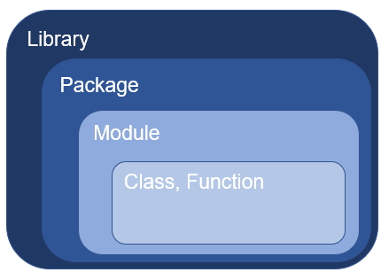

# Python ライブラリ紹介  

この記事では Python のライブラリを紹介します。  

様々な記事や資料の中で、ライブラリ (Library)、パッケージ (Package)、モジュール (Module) など、似た概念の言葉が現れます。  
モジュールは `.py` ファイルであり、再利用可能なクラス (Class) や関数 (Function) が内蔵されているもの、パッケージはいくつかのモジュールが集まったもの、ライブラリはいくつかのパッケージが集まったもの となります。  

これらを利用する際に、それぞれの違いを意識する必要はほとんどないと思います。本記事でも厳密な定義通りの呼称が用いられていない部分がありますが、ライブラリ、モジュール、パッケージ に関しては基本的に「同じもの」という認識で差し支えありません。  

## ユーティリティ  

### os, sys  

ファイルやフォルダ (ディレクトリ) のパスの取得や操作をしたり、一時的に環境変数を操作したりすることができます。  

[os と sys モジュールのつかいかた](./osとsysモジュールのつかいかた.ipynb)

### pathlib  

このモジュールはファイルシステムのパスを表すクラスを提供しています。  

- ファイルパスの操作  
- ファイルやフォルダのリネームや移動、作成や削除  
- ファイルやフォルダ一覧の取得  

などを容易に行うことができます。  

[pathlib モジュールのつかいかた](./pathlibモジュールのつかいかた.ipynb)

### datetime  

<今後追記予定>  

## 科学計算、データ分析  

### Pandas  

Pandas は表形式のデータの操作、可視化を得意とするライブラリです。  

[pandas 練習](./pandas練習.ipynb)  

### NumPy  

<今後追記予定>  

## 仕事効率化  

### xlwings  

xlwings は VBA ライクに Excel を扱うことができるライブラリです。  

[xlwings 練習](./xlwings練習.ipynb)  

### openpyxl  

<今後追記予定>  

### selenium  

<今後追記予定>  
