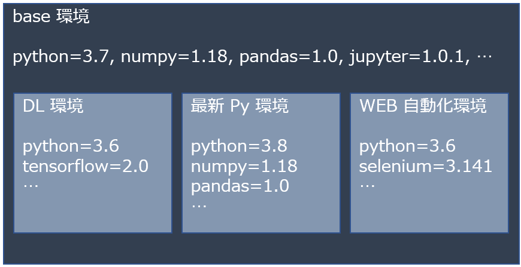

# conda コマンドの使い方 (Windows 向け)  

公式ドキュメントはこちら: [conda documentation](https://conda.io/projects/conda/en/latest/index.html)  

## conda とは  

`conda` は Anaconda (や Miniconda) に付属する、Python パッケージのインストールや仮想環境の管理/切替を行うためのコマンドです。  

## 仮想環境とは  

ひとつのコンピュータの中に、特定の用途の処理のための、依存関係を解決した Python やパッケージをまとめた環境を複数作成し、使用する際に `activate` (有効化) して切り替えて使えるようにしたものです。  

  

## conda コマンドの実行  

Anaconda のデフォルトインストールではパスが通っていないため、通常のコマンドプロンプトなどのターミナルでは `conda` や `python` コマンドのみで実行できません。  

そのため、スタートメニューから  

Anaconda3 (xx-bit) → Anaconda Prompt (anaconda3) または Anaconda Powershell Prompt  (anaconda3)  

で Anaconda Prompt を起動します。このターミナルの中では有効化された環境の `conda` や `python` へのパスが通った状態になっています。  

Anaconda Prompt が立ち上がると、  

```conda  
(base) C:\Users\USERNAME>
```  

とプロンプトが表示されます。ここで、`(base)` の部分から現在有効化されているのは基本となる `base` 環境であることがわかります。  

この `base` 環境にパッケージを追加することもできますが、**用途ごとに新しい環境を作成して必要な Python やパッケージをインストールすることを強く推奨します。**  

以下、主な `conda` コマンドを紹介していきます (プロンプト部分は省略しています)。  

---

### 新しい仮想環境を作成

```conda  
conda create -n [env_name]
```

### 新しい仮想環境を作成して、パッケージをインストール

```conda  
conda create -n [env_name] python=[version] [package1] [package2] ...
```

### 仮想環境の有効化  

```conda  
conda activate [env_name]
```

### 現在の仮想環境の無効化 (base に戻る)  

```conda  
conda deactivate
```

### 現在の仮想環境にパッケージを指定してインストール  

```conda  
conda install [package1] [package2] ...
```

パッケージのインストールに `pip` コマンドも使うことができます。`pip` でしかインストールすることができないパッケージもありますが、原則として、conda 仮想環境下では `conda` を優先して使い、`pip` を使う場合は `base` 以外の環境を作成し、その環境の中で使用することを強く推奨します。  

まれに `conda` と `pip` が競合し、環境が壊れてしまうことがあります。その場合は一度環境を削除したのち、再度作成してみてください。  

### 現在の仮想環境のインストール済パッケージの一覧表示  

```conda  
conda list
```

### 指定した仮想環境のインストール済パッケージの一覧表示  

```conda  
conda list -n [env_name]
```

### パッケージを指定してアンインストール  

```conda  
conda uninstall [package]
```

### パッケージを指定してアップデート  

```conda  
conda update [package]
```

### パッケージを一括アップデート  

```conda  
conda update --all
```

### 存在する仮想環境の一覧表示  

```conda  
conda info -e
```

### 仮想環境の削除  

```conda  
conda remove -n [env_name] --all
```

### 仮想環境をコピーして新規作成  

```conda  
conda create -n [new_env_name] --clone [origin_env_name]
```

### 仮想環境をファイル (yaml 形式) に書出し  

```conda  
conda env export -n [env_name] > xxxx.yaml
```

### ファイルから仮想環境を新規作成  

```conda  
conda env create --file xxxx.yaml
```
